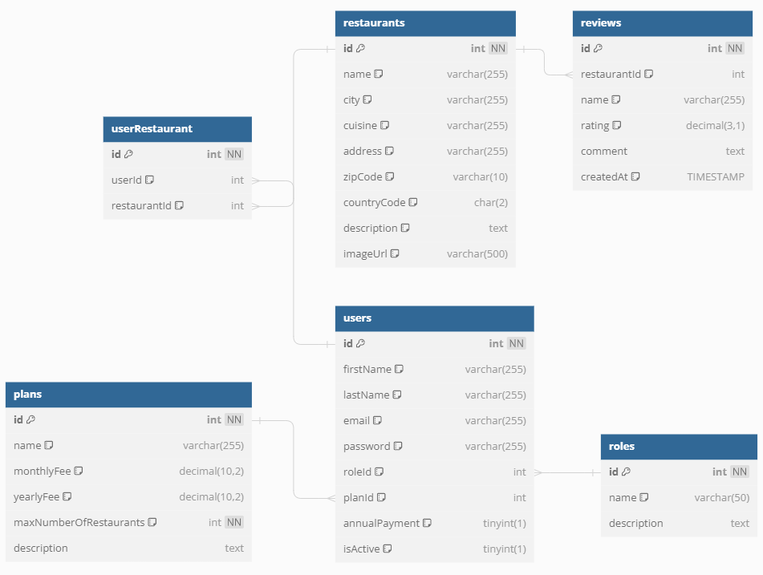

# DineEase Backend

## A feladat bemutatása

A **DineEase**, egy magyarországi székhelyű kis startup, kezdetben innovatív éttermi szoftverével tűnt fel a vendéglátás szektorban. Most egy vadonatúj szolgáltatással bővítik tevékenységüket, amelynek célja, hogy forradalmasítsa az emberek étterem keresését és az éttermekkel való kapcsolatfelvételt. A DineEase mindenre kiterjedő portálján a látogatók választhatnak az éttermek között, megtekinthetik bármelyik étterem teljes étlapját, és elolvashatják a korábbi vendégek értékeléseit az étterem szolgáltatásairól és ételeiről. Emellett asztalt is foglalhatnak az általuk kiválasztott étteremben, és a weboldalon vagy az alkalmazáson keresztül rendelhetnek és fizethetnek.

Korábban szabadúszó webfejlesztőként dolgoztál, de most fejlesztői állásra jelentkeztél a DineEase-nél. A vállalat vezetősége szeretné tesztelni a képességeidet, ezért a felvételi eljárás részeként arra kértek, hogy fejleszd ki az új szolgáltatásuk prototípusát. 

Első feladatként a DineEase szolgáltatás backend prototípusát kell létrehoznod. A backend adatokat biztosít a DineEase személyzete által kezelt admin alkalmazás és webalkalmazás számára.

A backend által szolgáltatott adatok egy SQLite adatbázisban vannak tárolva. Az adatbázis elérhető a dineease.db fájlban.

## A feladatok leírása

Több végpontot kell létrehoznod, amelyek a `http://localhost:5000/api/v1` alap URL-en lesznek elérhetők.

A végpontok technikai részletei az [`dineease.yaml`](dineease.yaml) fájlban találhatók OpenAPI formátumban.

### Felhasználók

A DineEase admin felületén lehetséges az étterem tulajdonos felhasználók listázása, valamint a felhasználó aktiválása és deaktiválása.
Ehhez három végpontot kell létrehoznod:

- összes felhasználó főbb adatainak lekérése
- kiválasztott felhasználó összes adatának lekérése
- felhasználó letiltása vagy aktiválása

### Éttermek

Az admin felületen listázni kell majd az éttermeket. Ehhez a következő végpontot kell megvalósítani:

- összes étterem lekérése az étterem értékeléseinek (vélemények) átlagolásával

### Tervek

A DineEase személyzete az admin alkalmazásban módosíthatja az előfizetési terveket. Ehhez a következő funkciókat kell biztosítani:

- összes terv adatainak lekérése
- kiválasztott terv módosítása

### Szerepkörök

A felhasználói szerepkörök nem módosíthatók az admin felületen, de szükséged lehet a szerepkör adatokra. Ehhez csak egy végpontot kell létrehoznod.

- összes szerepkör adatainak lekérése

### Vélemények

Az admin alkalmazásban megjeleníthetők az étteremekről beküldött vélemények, és a nem kívánt bejegyzések törölhetők. Ehhez két végpontot kell létrehoznod:

- összes vélemény lekérése az étterem főbb adataival (név és város), időrendben visszafelé rendezve
- kiválasztott vélemény törlése

### Regisztráció

A DineEase weboldalán az étterem tulajdonosok regisztrálhatnak személyes adataik és az általuk kiszolgált étterem vagy éttermek adatainak megadásával. Emellett a regisztráció során meg kell adniuk a kiválasztott előfizetési tervet is.

- Regisztráció küldése, amely új étterem tulajdonos felhasználót hoz létre, beállítja a kiválasztott előfizetési tervet, és létrehoz egy vagy több étterem rekordot.
- Ügyelj a validációra, beleértve azt is, hogy ne fogadjon el több éttermet, mint amennyit a kiválasztott terv engedélyez.
